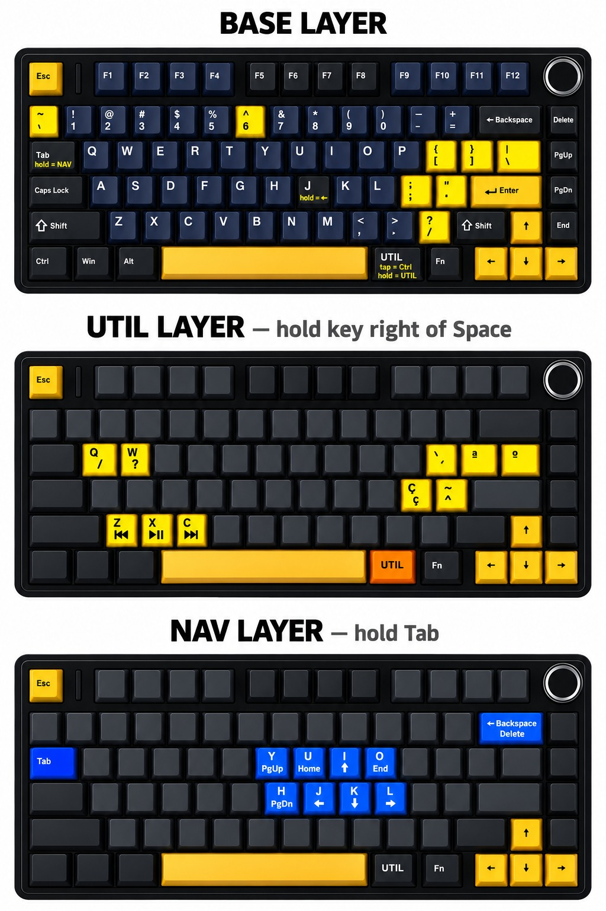

# AULA F75 + Kanata



🇧🇷 Português · [🇺🇸 English](README.en.md)

Layout personalizado para o teclado **AULA F75** usando o [Kanata](https://github.com/jtroo/kanata), um remapeador de teclas por software. O firmware do teclado não é alterado (nada de QMK/VIA).

```
AULA F75  →  sistema operacional  →  Kanata  →  layout personalizado
```

| Sistema | Status | Configuração | Guia |
|---|---|---|---|
| Windows | ✅ funcionando | [`config/windows/f75.kbd`](config/windows/f75.kbd) | [docs/windows.md](docs/windows.md) |
| Linux (Ubuntu 24.04) | ✅ funcionando | [`config/linux/f75.kbd`](config/linux/f75.kbd) | [docs/linux.md](docs/linux.md) |
| macOS | 🚧 em andamento | – | [docs/macos.md](docs/macos.md) |

Etapas do projeto: [docs/milestones.md](docs/milestones.md)

## O teclado

- Layout 75%, hot swap, RGB, botão giratório (knob)
- Conexão: USB-C, 2.4 GHz e Bluetooth. O Kanata funciona em qualquer uma delas.
- USB VID `258A` / PID `010C`, chipset SinoWealth
- Keycaps com legenda americana (ANSI) e sublegendas ABNT2

## Premissas

1. **Layout do sistema: Português (Brasil) ABNT2.** O Kanata envia posições de tecla, e é o layout do sistema que decide qual caractere aparece.
2. **Fn trocado com o Ctrl direito no software da AULA.** O Fn original é tratado pelo firmware e nunca chega ao sistema, então o Kanata não enxerga essa tecla. No software oficial da AULA (Key assignment → Default), a posição do Fn passa a enviar **RCtrl** e a posição do Ctrl direito passa a ser **FN**. A troca fica gravada no teclado e vale em qualquer computador.

A tecla ao lado do Espaço (que envia RCtrl) é chamada de **UTIL** neste repositório. Ela funciona como um "AltGr" próprio.

## Camadas

### BASE

Legenda de baixo = tecla sozinha, legenda de cima = com Shift. Só estão listadas as teclas que mudam.

| Tecla física | Sozinha | Shift |
|---|---|---|
| À esquerda do 1 | `~` (acento) | `` ` `` (acento) |
| 6 | `6` | `^` (acento) |
| Ao lado do P | `{` | `[` |
| 2ª depois do P | `}` | `]` |
| 3ª depois do P | `\` | `\|` |
| Ao lado do L | `;` | `:` |
| 2ª depois do L | `"` | `'` |
| `/` | `/` | `?` |

Teclas com dupla função (tap-hold):

| Tecla | Toque rápido | Segurada |
|---|---|---|
| Tab | Tab | camada **NAV** |
| J | j | ← |
| UTIL (ao lado do Espaço) | Ctrl | camada **UTIL** |

### UTIL (segurando a tecla ao lado do Espaço)

| Tecla | Sozinha | Shift |
|---|---|---|
| Q | `/` | – |
| W | `?` | – |
| Ao lado do P | `´` (acento) | `` ` `` (acento) |
| 2ª depois do P | `ª` | – |
| 3ª depois do P | `º` | – |
| Ao lado do L | `ç` | `Ç` |
| 2ª depois do L | `~` (acento) | `^` (acento) |
| Z / X / C | faixa anterior / play-pause / próxima | – |

### NAV (segurando Tab)

| Tecla | Função |
|---|---|
| I / J / K / L | ↑ / ← / ↓ / → |
| U / O | Home / End |
| Y / H | PgUp / PgDn |
| Backspace | Delete |

Os acentos marcados como "(acento)" são teclas mortas: aperte o acento e depois a letra (`~` + `a` = `ã`). Para o símbolo sozinho, aperte o acento e depois Espaço.

## Saída de emergência

**Ctrl esquerdo + Espaço + Esc** fecha o Kanata na hora, em qualquer sistema.

## Estrutura do repositório

```
config/
  windows/f75.kbd     configuração para Windows
  linux/f75.kbd       configuração para Linux
  macos/              em andamento
docs/
  windows.md          instalação e início automático no Windows
  linux.md            instalação e serviço systemd no Linux
  macos.md            rascunho da instalação no macOS
  milestones.md       etapas do projeto e status
  image-prompt.md     prompt para gerar a imagem das camadas
  en/                 guias em inglês
linux/
  kanata.service      serviço systemd de usuário
assets/
  cover.jpeg          imagem de capa
```

## Diferenças entre Windows e Linux

As duas configurações fazem a mesma coisa. Muda só a forma de gerar alguns caracteres:

| Caractere | Windows | Linux |
|---|---|---|
| `/ ?` (UTIL + Q/W e tecla `/`) | Unicode direto | tecla extra do ABNT2 (`ro`) |
| `ª º` | Unicode direto | AltGr + tecla do ABNT2 |
| demais | tecla do ABNT2 | tecla do ABNT2 |

No Linux, o Unicode do Kanata depende do atalho Ctrl+Shift+U, que muitos programas não aceitam. Por isso lá foram usadas as teclas nativas do ABNT2.
